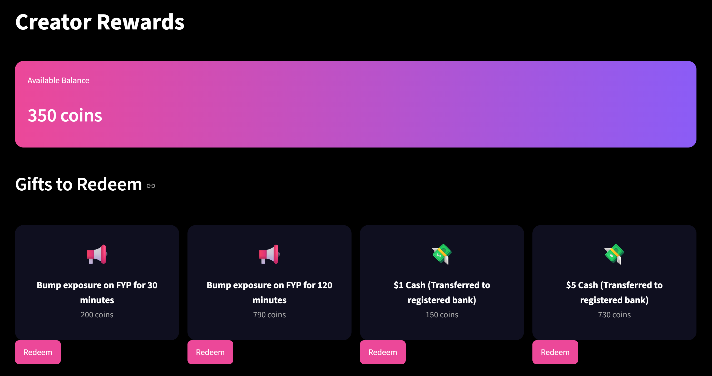
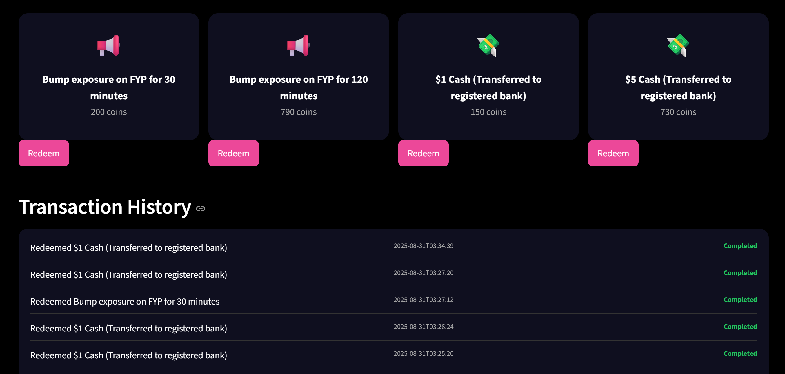
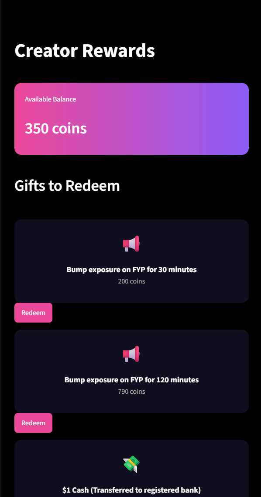
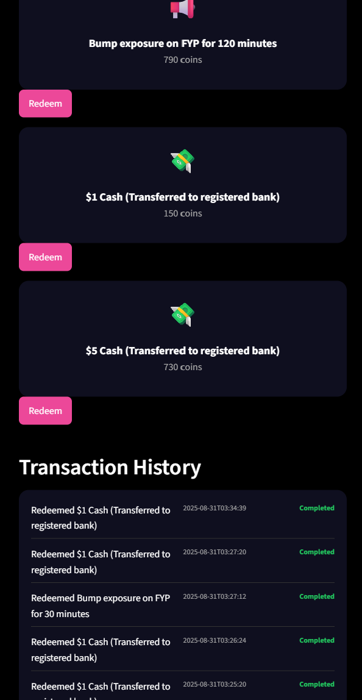
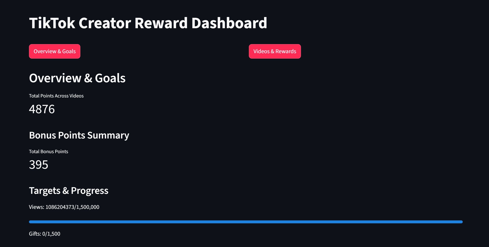
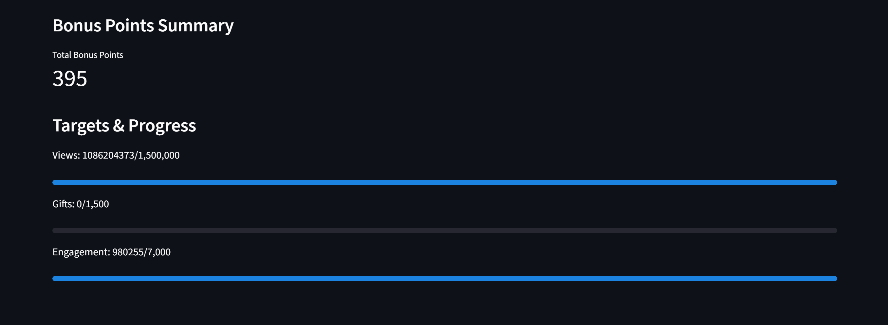

# Hackoclock

Evaluate content value, together with various video metrics to generate a fair value-system for TikTok to reward content creators fairly, and reimagine the ways content creators can be rewarded. 

# 1. Running the application

1. Run 'pip install -r requirements.txt'

2. Run 'streamlit run rewards.py' for the TikTok Rewards Shop

3. Run 'streamlit run dashboard.py' for the TikTok Creator Dashboard

# 2. Dataset used
- Made use of dataset ([https://www.kaggle.com/datasets/erikvdven/tiktok-trending-december-2020](https://www.kaggle.com/datasets/erikvdven/tiktok-trending-december-2020)) containing fields such as creator's id, createTime, webVideoUrl, diggCount (number of likes), shareCount, commentCount etc.
- From the dataset, our own database was created with further extractions.

# 3. Table Documentation
## creators
- creator_id: unique id of each TikTok content creator
- follower_count: No. of followers for that TikTok creator (Type: int)
- video_count: No. of total videos the creator has made
- total_points: Calculated column which sums the total points earned by the creator

## videos
- creator_id: foreign key in videos table 
- video_id: unique id of each TikTok video posted
- url: text string showing the link of the TikTok video (webpage)
- views, likes, shares, bookmarks, comments: Count of fields on that TikTok video
- engagement_rate: sum of likes_per_view, shares_per_view, bookmarks_per_view, comments_per_view
- likes_per_view: No. of Likes / No. of Views
- shares_per_view, bookmarks_per_view, comments_per_view: same as above but with their respective values
- date_posted: Date when the TikTok video was created and posted
- video_points: Calculated column which classifies a few variables for content creators to earn points
- sentiment: Using genai api, it helps to assign a score 0 to 1 (0 negative 1 positive) by analysing the video content through the storage buckets with the downloaded TikTok videos.

## shop
Rewards for creators to redeem with the points they earned from their videos.
- reward_id: unique id for each type of reward
- amount: indicates the amount of points needed
- exposure: description of what reward is given

## redemptions
Stores the log of rewards redemption by creators
- id
- reward_id
- creator_id
- amount
- exposure
- creation_date

# 4. Scoring Mechanism
- Using Z-score and scaling, the video_points is calculated by summing the z-scores of 7 fields: views, likes, shares, bookmarks, engagement_rate, comments & sentiment
- The points are then scaled to match the shop table requirements connected to the main webpage UI, encouraging content creators to make videos of better quality and of appropriate content.

# 5.  Media

## Creators Reward Shop

  
  

  
  

## Creator Dashboard

  
  

